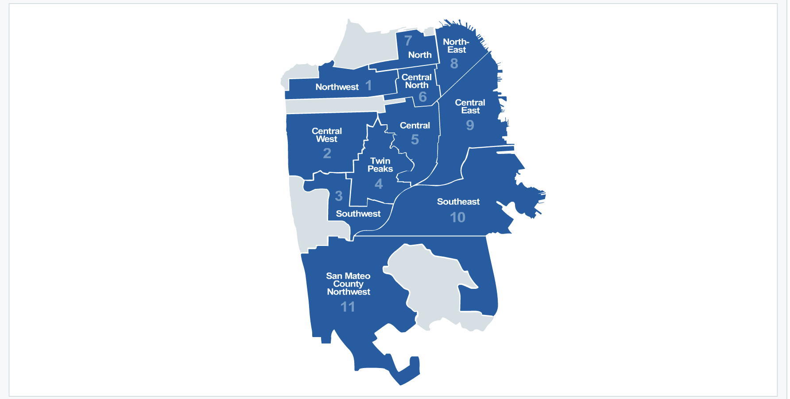

# 🏙️ San Francisco Rental Price Prediction

## 📌 Overview
This project combines **data analysis** using Python and **linear regression modeling** with an interactive **Streamlit web application** for predicting rental prices of housing units in San Francisco. The project starts with exploring the dataset, preprocessing it, and building a predictive model, which is then deployed using Streamlit for user interaction.

---

## 📁 Project Structure

```
.
├── main.py                      # Entry point that links to Streamlit pages
├── model.pkl                    # Trained regression model file
├── requirements.txt             # Python dependencies for the project
├── README.md                    # Project documentation
├── .gitignore                   # Git ignore rules
│
├── notebooks/
│   └── Analysis.ipynb           # Jupyter notebook with data exploration and modeling
│
├── Data/
│   ├── sf_clean.csv             # Cleaned dataset
│   └── SFAR_map.png             # SF neighborhood visual map
│
├── Pages/
│   └── Predict.py               # Streamlit page for rental price prediction
```

---

## 📊 Key Steps in the Analysis (`Analysis.ipynb`)

1. **Dataset Loading**  
   Loaded using the `pandas` library from a CSV file.

2. **Data Preprocessing**  
   - Checked and handled missing values.  
   - Encoded categorical variables using one-hot encoding.

3. **Train-Test Split**  
   Split the dataset into training and testing sets.

4. **Model Training**  
   Trained a **linear regression** model using `statsmodels`.

5. **Model Evaluation**  
   Used **R² score** and **Mean Absolute Error (MAE)** to evaluate model performance.

6. **Feature Importance**  
   Examined model coefficients to interpret feature impact.

7. **Residual Analysis**  
   Visualized residuals to validate linear regression assumptions.

8. **Final Performance**  
   Achieved **R² score = 0.784** and **MAE ≈ $436.50** on the test set.

---

## 🌐 Streamlit Web Application

### `Home.py`: Welcome Page
- Displays project objective and context.
- Explains key influencing features:
  - Square footage
  - Bedrooms & bathrooms
  - Laundry type
  - Pet policy
  - Housing type
  - Parking availability
  - Neighborhood/District
- Displays San Francisco district map.
- Includes navigation to prediction form.

### `predict.py`: Prediction Interface
- Users enter property details.
- Model makes prediction using trained coefficients.
- Displays **estimated rent price** in dollars using `model.pkl`.

---

## 🚀 How to Run the Project Locally

1. **Clone the Repository**
   ```bash
   git clone <repository-url>
   cd <project-folder>
   ```

2. **Install Dependencies**
   ```bash
   pip install -r requirements.txt
   ```

3. **Start Streamlit App**
   ```bash
   streamlit run Home.py
   ```

   You can then navigate to the prediction page from the UI.

---

## 💡 Objective
To assist **tenants, landlords, and agents** in estimating fair rental prices across San Francisco using a machine learning model trained on real-world data. This tool:
- Increases transparency.
- Encourages data-driven decisions.
- Simplifies affordability checks.

---

## 📈 Sample Prediction Logic

- User input is collected via form.
- Data is encoded and aligned to model format.
- Prediction is made on log(price) scale and converted back using exponential.
- Output is displayed as:
  ```python
  st.success(f"Estimated Rent: ${predicted_price}")
  ```

---

## 📷 Screenshot

| Home Page | Prediction Page |
|-----------|-----------------|
|  | Prediction shown after form submission |

---

## 📌 Results

- **Model**: Linear Regression (`statsmodels`)
- **R² Score**: 0.784
- **Mean Absolute Error (MAE)**: $436.50
- **Deployment**: Interactive UI via Streamlit

---

## 📚 Conclusion

This project demonstrates:
- The power of **linear regression** for price prediction.
- The importance of **feature engineering** and **data preprocessing**.
- Deployment of machine learning models using **Streamlit** for real-time predictions.

---

## 🔧 Tools & Technologies

- Python
- Pandas, NumPy
- statsmodels
- Streamlit
- joblib (for model serialization)

---

## 🙌 Acknowledgements

Special thanks to open-source data contributors and the San Francisco Association of Realtors for public district mappings.

---

## 📄 License

This project is licensed under the MIT License - see the `LICENSE` file for details.
